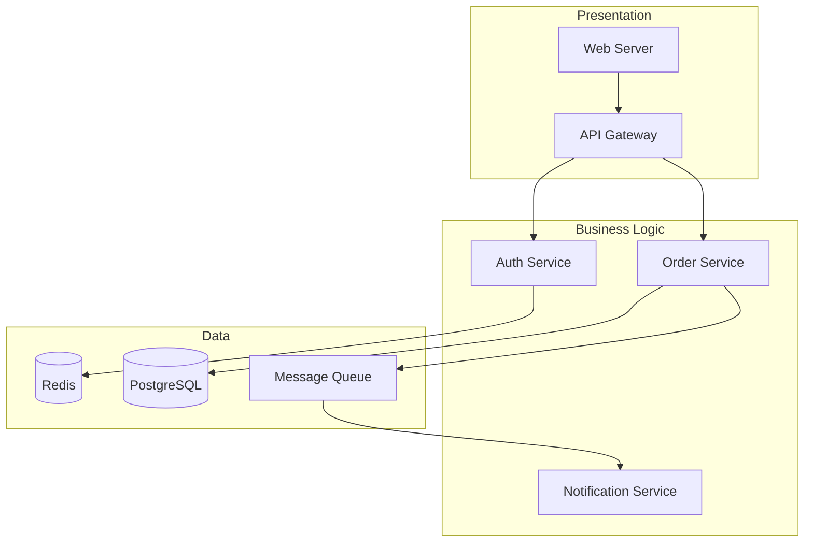
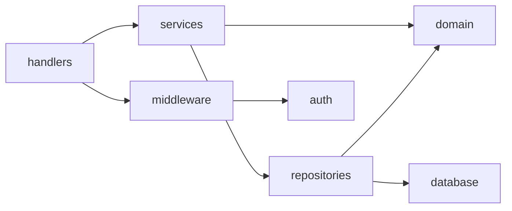
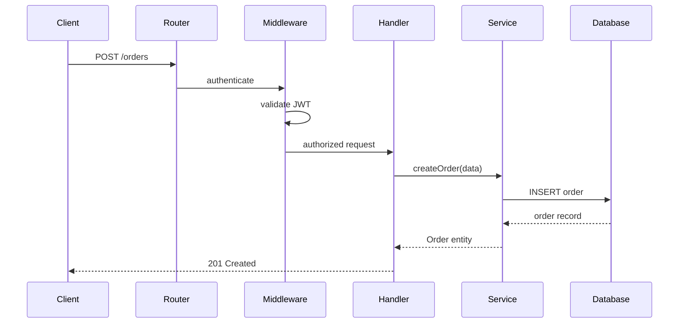

# Codebase Overview Skill — Implementation Plan

> **For agentic workers:** REQUIRED SUB-SKILL: Use superpowers:subagent-driven-development (recommended) or superpowers:executing-plans to implement this plan task-by-task. Steps use checkbox (`- [ ]`) syntax for tracking.

**Goal:** Build a Claude Code plugin skill that produces high-level architectural analysis of codebases, designed for experienced developers learning unfamiliar systems.

**Architecture:** A single plugin (`aigent-skills`) containing one skill (`codebase-overview`). The skill uses progressive disclosure: a lean SKILL.md (~2000 words) with three reference files containing detailed procedures. The skill guides Claude through two phases — autonomous survey then interactive deep dives — producing a living markdown document with mermaid diagrams.

**Tech Stack:** Claude Code plugin system, Markdown, Mermaid.js for diagrams.

**Spec:** `docs/superpowers/specs/2026-04-11-codebase-overview-design.md`

---

## File Structure

```
aigent-skills/
├── .claude-plugin/
│   └── plugin.json                          # Plugin manifest
└── skills/
    └── codebase-overview/
        ├── SKILL.md                         # Core skill (~2000 words)
        └── references/
            ├── phase1-analysis.md           # Detailed Phase 1 procedures
            ├── phase2-deep-dives.md         # Phase 2 mechanics and finalization
            └── document-template.md         # Output template with mermaid examples
```

---

### Task 1: Create Plugin Manifest

**Files:**
- Create: `.claude-plugin/plugin.json`

- [ ] **Step 1: Create the plugin directory and manifest**

```json
{
  "name": "aigent-skills",
  "version": "0.1.0",
  "description": "Personal collection of Claude Code skills for architectural analysis and learning",
  "author": {
    "name": "roaanv"
  }
}
```

- [ ] **Step 2: Verify the plugin structure**

Run: `ls -la .claude-plugin/`
Expected: `plugin.json` exists

- [ ] **Step 3: Commit**

```bash
git add .claude-plugin/plugin.json
git commit -m "feat: add plugin manifest for aigent-skills"
```

---

### Task 2: Create SKILL.md — Core Skill Definition

This is the main skill file. It must stay lean (~2000 words), using imperative/infinitive form, with third-person description in frontmatter. Detailed procedures go in references/.

**Files:**
- Create: `skills/codebase-overview/SKILL.md`

- [ ] **Step 1: Create the skill directory**

Run: `mkdir -p skills/codebase-overview/references`

- [ ] **Step 2: Write SKILL.md**

```markdown
---
name: Codebase Overview
description: >
  This skill should be used when the user asks to "review this codebase",
  "analyze the architecture", "what patterns does this project use",
  "help me understand this system", "give me an architectural overview",
  "how is this project structured", or wants to learn how an unfamiliar
  codebase is designed at a high level. Produces a two-phase architectural
  analysis: autonomous survey followed by interactive deep dives.
---

# Codebase Overview

Produce a high-level architectural analysis of a codebase. Designed for experienced
developers (Java/C#/Python/TypeScript/Go background) who want to learn how unfamiliar
systems are designed — not how they are implemented line-by-line.

The goal: extract enough architectural understanding to inform the user's own system
design work in that domain.

## What This Skill Is NOT

- Not a code quality reviewer — no "this is bad/good" judgments
- Not a refactoring tool — no code generation or change suggestions
- Not a line-by-line code explainer — stays at the component/pattern level
- Read-only analysis — the only file created is the overview document

## Optional Parameters

- **model** — override the session model for subagents (inherits session model by default)
- **focus** — bias the survey toward a specific area (e.g. "agent orchestration layer").
  When provided, still perform the full breadth-first survey but allocate more depth
  to the focused area (trace additional flows, read more files from that subsystem).

## Two-Phase Process

### Phase 1: Autonomous Survey

Run a breadth-first exploration without user interaction. Follow these steps in order:

1. **Project Identity** — Read README, docs, ADRs, package manifests. Identify language(s),
   framework(s), build system, repo structure. If local docs are insufficient (README < ~20
   lines or missing, no docs/ADR directories), trigger a web search fallback for external
   documentation. See `references/phase1-analysis.md` for detailed procedures.

2. **Structural Map** — Analyze top-level directory layout and one level deeper. Identify
   architectural layers and module boundaries. Produce a mermaid component diagram.

3. **Dependency Analysis** — Categorize external dependencies by purpose. Map internal
   module relationships. Produce a mermaid dependency graph.

4. **Key Flow Tracing** — Identify 2-3 primary entry points. Trace each flow at the
   component level (not line-by-line). Produce mermaid sequence diagrams. For monorepos,
   trace flows in the primary service; flag others for Phase 2.

5. **Pattern Recognition** — Identify design patterns (repository, factory, strategy,
   observer, middleware, CQRS, etc.) and architectural patterns (hexagonal, clean
   architecture, MVC, microservices, etc.). Note unusual or noteworthy choices.

6. **Initial Report** — Assemble findings using the template in
   `references/document-template.md`. Present conversationally in the terminal AND
   simultaneously write to `docs/architecture-overview.md` as a working draft.

**File reading strategy:** Read for structure (imports, exports, signatures, interfaces),
not implementation bodies. Priority: README/docs -> package manifests -> directory structure
-> entry points -> one representative file per major module.

### Phase 2: Interactive Deep Dives

After presenting the Phase 1 report, transition to interactive mode.
See `references/phase2-deep-dives.md` for detailed procedures.

1. **Suggest areas** — Generate 3-5 specific suggestions for deeper exploration based on
   what Phase 1 actually found. These must be specific to this codebase, not generic.

2. **Execute deep dives** — For each user request, dispatch a focused subagent to explore
   the area. Present findings conversationally AND append to the working draft under
   `## Deep Dive: {topic}`. Generate new mermaid diagrams when structure is worth visualizing.

3. **Finalize** — When the user signals completion ("finalize", "wrap it up"), synthesize
   the Transferable Principles section, ask if the user wants to reorganize/trim the
   document, and save the final version.

## Analysis Principles

### Fact vs. Inference Separation

All analysis must clearly distinguish between:
- **Observed (fact):** directly evident from code — file structure, imports, interfaces, explicit patterns
- **Inferred (reasoning):** why choices were likely made, labeled as inference. Web-sourced
  context includes the source URL.

### Language Translation

When the codebase uses a language outside the user's primary languages
(Java/C#/Python/TypeScript/Go), map language-specific idioms to equivalents in familiar
languages. Example: "This Elixir GenServer is analogous to a long-running service with
an internal message queue in Java."

### Neutral Tone

Describe architectural trade-offs factually (e.g. "event sourcing adds complexity but
provides a full audit trail") without judging whether a choice is good or bad.

### Mermaid Diagrams

Always include mermaid diagrams for: component relationships, internal dependency graphs,
and key flow sequence diagrams. See `references/document-template.md` for diagram format
examples.

## Edge Cases

- **Minimal docs:** Web search fallback fires. If nothing found externally, note that
  analysis is derived entirely from code structure.
- **Libraries (no entry points):** Shift from flow tracing to public API surface analysis.
  Map interface boundaries and extension points.
- **Trivially small codebases:** Acknowledge honestly. Still provide value: patterns,
  dependency choices, design decisions at the small scale.
- **Monorepos:** Map all services/packages in Phase 1. Flow-trace the primary/largest
  service. Flag others for Phase 2.
- **Re-invocation:** If `docs/architecture-overview.md` exists, ask whether to start
  fresh or continue from the existing document.

## Additional Resources

### Reference Files

For detailed procedures and templates, consult:
- **`references/phase1-analysis.md`** — Detailed Phase 1 analysis steps, file reading
  strategy, web search fallback logic, pattern recognition guide
- **`references/phase2-deep-dives.md`** — Deep dive types and execution, subagent dispatch,
  transition prompts, finalization and transferable principles synthesis
- **`references/document-template.md`** — Complete output document template with mermaid
  diagram examples and fact/inference formatting
```

- [ ] **Step 3: Verify word count is within target**

Run: `wc -w skills/codebase-overview/SKILL.md`
Expected: approximately 700-900 words (body only, excluding frontmatter). This is lean enough — detailed content lives in references/.

- [ ] **Step 4: Commit**

```bash
git add skills/codebase-overview/SKILL.md
git commit -m "feat: add core SKILL.md for codebase-overview skill"
```

---

### Task 3: Create Phase 1 Analysis Reference

Detailed procedures for the autonomous survey phase. This is loaded by Claude only when the skill triggers and Phase 1 begins.

**Files:**
- Create: `skills/codebase-overview/references/phase1-analysis.md`

- [ ] **Step 1: Write phase1-analysis.md**

```markdown
# Phase 1: Autonomous Survey — Detailed Procedures

## Step 1: Project Identity

### Local Documentation Scan

Read in this order, stopping when sufficient context is gathered:

1. **README.md / README** — project purpose, tech stack, setup instructions
2. **docs/ or doc/ directory** — architecture docs, guides, ADRs
3. **CONTRIBUTING.md** — reveals build process, testing conventions, code organization
4. **ARCHITECTURE.md or similar** — explicit architectural documentation
5. **Package manifests** — detect by language:
   - JavaScript/TypeScript: `package.json`, `package-lock.json`, `yarn.lock`, `pnpm-lock.yaml`
   - Python: `pyproject.toml`, `setup.py`, `setup.cfg`, `requirements.txt`, `Pipfile`
   - Go: `go.mod`, `go.sum`
   - Rust: `Cargo.toml`, `Cargo.lock`
   - Java: `pom.xml`, `build.gradle`, `build.gradle.kts`
   - C#/.NET: `*.csproj`, `*.sln`, `Directory.Build.props`
   - Ruby: `Gemfile`, `*.gemspec`
   - PHP: `composer.json`
   - Elixir: `mix.exs`
6. **Configuration files** — `docker-compose.yml`, `Makefile`, `Dockerfile`, CI configs
   (`.github/workflows/`, `.circleci/`, `Jenkinsfile`)
7. **Monorepo indicators** — workspace configs, `lerna.json`, Nx config, Turborepo config,
   multiple `go.mod` files, Bazel `BUILD` files

### Web Search Fallback

Trigger when: README is < ~20 lines or missing AND no docs/ or ADR/ directories exist.

Search strategy:
1. Search for the project's GitHub URL — look for wiki pages, discussions, and issues
   tagged with "architecture" or "design"
2. Search for `"{project name}" architecture` or `"{project name}" design`
3. Check package metadata for homepage/repository URLs and search those
4. Search for blog posts or conference talks about the project

When incorporating web-sourced findings:
- Label each finding with its source URL
- Place in the "Inferred" category of the analysis
- Note the date of the source if available
- If web search yields nothing useful, state explicitly: "No external documentation found.
  Analysis below is derived entirely from code structure."

## Step 2: Structural Map

### Directory Analysis

1. List the top-level directory layout using `ls` or glob
2. For each major directory, list one level deeper
3. Ignore generated directories: `node_modules/`, `vendor/`, `target/`, `build/`, `dist/`,
   `.git/`, `__pycache__/`, `.next/`, `.nuxt/`, `venv/`, `.venv/`

### Identifying Architectural Layers

Look for these common organizational patterns:

**Layer-based (horizontal):**
- `controllers/`, `handlers/`, `routes/` → presentation layer
- `services/`, `usecases/`, `domain/`, `core/` → business logic layer
- `repositories/`, `dal/`, `persistence/`, `db/` → data access layer
- `middleware/`, `interceptors/` → cross-cutting concerns
- `models/`, `entities/`, `types/` → domain model

**Feature-based (vertical):**
- Each top-level directory represents a bounded context or feature
- Contains its own controller, service, repository within the feature directory

**Hybrid:**
- Combination of both, often with shared infrastructure

### Component Diagram

Produce a mermaid component diagram showing:
- Major components/modules as boxes
- Dependencies between them as arrows
- External systems they interact with
- Layer boundaries if applicable

## Step 3: Dependency Analysis

### External Dependencies

Read the primary package manifest and categorize each dependency:

| Category | Examples |
|----------|----------|
| Framework | Express, Spring, Django, Gin, Actix |
| Persistence | Prisma, SQLAlchemy, GORM, TypeORM |
| Messaging | RabbitMQ client, Kafka client, Redis |
| Observability | OpenTelemetry, Prometheus, Datadog |
| Authentication | Passport, JWT libraries, OAuth clients |
| Testing | Jest, pytest, testify, JUnit |
| Build/Dev | Webpack, Vite, ESBuild, tsc |
| Utilities | Lodash, Apache Commons, etc. |

Focus on production dependencies. Dev dependencies are worth noting if they reveal
testing or build patterns.

### Internal Dependencies

Examine import/require statements across modules to map which modules depend on which.
Focus on module-level dependencies, not file-level.

Produce a mermaid graph showing internal module dependencies with arrow direction
indicating "depends on."

## Step 4: Key Flow Tracing

### Finding Entry Points

Search for entry points in this order:

1. **Explicit main:** `main()`, `main.go`, `main.py`, `index.ts`, `app.ts`, `Program.cs`
2. **Framework entry:** route definitions, controller decorators, handler registrations
3. **CLI entry:** command definitions, argument parsers
4. **Event entry:** event listeners, message consumers, webhook handlers
5. **Scheduled entry:** cron jobs, scheduled tasks

### Tracing a Flow

For each entry point, trace at the component level:
1. Where does the request/event enter?
2. What validates or preprocesses it?
3. What business logic processes it?
4. What external systems does it interact with?
5. What does it return or produce?

Read function signatures and imports to trace the flow — do NOT read function bodies
unless the signature alone is insufficient to determine the next component.

### Sequence Diagrams

Produce a mermaid sequence diagram for each flow showing:
- Actors/components as participants
- Messages/calls between them (with meaningful labels)
- Return values where architecturally significant
- External system interactions

## Step 5: Pattern Recognition

### Design Patterns to Look For

Examine code structure (not implementation) for these patterns:

| Pattern | Indicators |
|---------|-----------|
| Repository | Classes/interfaces named `*Repository`, `*Repo`, `*Store`, `*DAO` |
| Factory | Classes named `*Factory`, `create*` methods returning interfaces |
| Strategy | Interfaces with multiple implementations, runtime selection |
| Observer/Event | Event emitters, listeners, subscribers, pub/sub |
| Middleware/Pipeline | Chain of handlers, `use()`, `pipe()` |
| Decorator | Wrapper classes, annotations/decorators modifying behavior |
| Dependency Injection | Constructor injection, DI containers, providers |
| CQRS | Separate command/query models, command handlers |
| Event Sourcing | Event stores, event replay, aggregate roots |
| Saga/Orchestration | Multi-step workflows, compensating transactions |

### Architectural Patterns to Identify

| Pattern | Indicators |
|---------|-----------|
| Clean/Hexagonal | Ports & adapters, dependency inversion, domain isolation |
| MVC/MVVM | Model-View-Controller separation, view models |
| Microservices | Multiple deployable units, service discovery, API gateway |
| Modular Monolith | Single deployment, clear module boundaries |
| Event-Driven | Message brokers, async processing, eventual consistency |
| Serverless | Function handlers, cloud function configs |
| Plugin/Extension | Plugin interfaces, extension points, dynamic loading |

### File Reading Strategy for Patterns

Read these file types to identify patterns:
- Interface/trait/protocol definitions
- Base classes and abstract classes
- Configuration and wiring files (DI setup, module registration)
- Entry points and routers
- Directory-level index/barrel files

Do NOT read:
- Test files (at this stage)
- Generated code
- Vendor/dependency code
- Implementation details of concrete classes
```

- [ ] **Step 2: Commit**

```bash
git add skills/codebase-overview/references/phase1-analysis.md
git commit -m "feat: add Phase 1 analysis reference for codebase-overview"
```

---

### Task 4: Create Phase 2 Deep Dives Reference

Detailed procedures for the interactive exploration phase and finalization.

**Files:**
- Create: `skills/codebase-overview/references/phase2-deep-dives.md`

- [ ] **Step 1: Write phase2-deep-dives.md**

```markdown
# Phase 2: Interactive Deep Dives — Detailed Procedures

## Transition from Phase 1

After presenting the Phase 1 report, transition to interactive mode with a prompt like:

> "That's the high-level picture. What areas would you like to explore further?
> Based on what I found, here are some areas that look architecturally interesting:"
>
> - {suggestion 1 — specific to what was found}
> - {suggestion 2 — specific to what was found}
> - {suggestion 3 — specific to what was found}
>
> "Or ask about anything else you see in the overview."

### Generating Suggestions

Suggestions must be specific to THIS codebase, not generic. Generate them by identifying:

1. **Complex components** — modules with many internal dependencies or that many other
   modules depend on
2. **Unusual patterns** — anything that deviates from the dominant architectural style
3. **Critical paths** — flows that touch the most components or involve external systems
4. **Interesting boundaries** — where the architecture shifts style (e.g. sync to async,
   monolith to microservice boundary)
5. **Unfamiliar patterns** — patterns the user might not have seen in their primary
   languages (Java/C#/Python/TypeScript/Go)

## Deep Dive Execution

### General Procedure

For each user request:

1. Identify which files and modules are relevant to the requested topic
2. Dispatch a subagent with a focused prompt (see templates below)
3. Present findings conversationally in the terminal
4. Append findings to the working draft under `## Deep Dive: {topic}`
5. Include new mermaid diagrams when the deep dive reveals visualizable structure

### Deep Dive Types and Subagent Prompts

#### "Trace the {X} flow"

Goal: Follow a specific flow end-to-end through all layers.

Subagent prompt template:
> "Trace the {X} flow in this codebase end-to-end. Start from the entry point and
> follow it through every component it touches. For each step, note: the component
> name, what it does to the data/request, and what it passes to the next component.
> Report the file path where each component lives. Produce a mermaid sequence diagram
> of the complete flow. Focus on the architectural flow, not implementation details.
> Clearly label anything you infer vs. directly observe."

#### "How does {component} work?"

Goal: Examine a subsystem's internal design and boundaries.

Subagent prompt template:
> "Analyze the internal design of the {component} subsystem. Identify: its public
> interface (what other components can call), its internal structure (sub-components,
> classes, key abstractions), its dependencies (what it imports/uses), and its design
> patterns. Report file paths for key files. Produce a mermaid diagram of its internal
> structure if it has multiple sub-components. Focus on design, not implementation.
> Clearly label inferences."

#### "What pattern is used for {X}?"

Goal: Identify and explain the design pattern behind a specific concern.

Subagent prompt template:
> "Identify the design pattern used for {X} in this codebase. Explain: what the pattern
> is, how it's structured here (key classes/interfaces/functions involved with file paths),
> and what problem it solves. If the codebase uses a language outside Java/C#/Python/
> TypeScript/Go, map the pattern to an equivalent in one of those languages. Clearly
> label inferences about why this pattern was chosen."

#### "Compare this to how you'd do it in {language}"

Goal: Map the approach to the user's familiar languages.

Subagent prompt template:
> "Analyze how {aspect} is implemented in this codebase. Then describe how the same
> architectural approach would typically be implemented in {language}, including:
> which libraries/frameworks are commonly used, what the equivalent abstractions are,
> and where the approaches would differ due to language capabilities. Focus on
> architectural equivalence, not line-by-line translation."

#### "What are the trade-offs of this approach?"

Goal: Analyze alternatives and why they likely weren't chosen.

Subagent prompt template:
> "Analyze the approach used for {aspect} in this codebase. Describe: what approach
> is used (observed), what alternative approaches exist for solving the same problem,
> the trade-offs of each alternative vs. what was chosen, and any indicators in the
> code for why this approach was selected. Present trade-offs as neutral factual
> comparisons, not quality judgments. Clearly label inferences."

#### Freeform Questions

For questions that don't match a template, construct a subagent prompt that:
1. States the specific question to answer
2. Instructs the subagent to focus on architecture, not implementation
3. Requires fact/inference separation
4. Requests mermaid diagrams if the answer involves structure
5. Asks for language translation if relevant

### Updating the Working Draft

After each deep dive, append to `docs/architecture-overview.md`:

```markdown
## Deep Dive: {topic title}

{Findings in the same fact/inference format as Phase 1}

{Mermaid diagrams if applicable}
```

Maintain consistent formatting with the Phase 1 sections.

## Finalization

Triggered when the user signals completion (e.g. "finalize", "wrap it up", "that's enough").

### Step 1: Synthesize Transferable Principles

Review all findings (Phase 1 + all deep dives) and extract domain-independent principles.

Each principle should be:
- **General** — applicable beyond this specific codebase
- **Actionable** — something the user could apply when designing their own system
- **Grounded** — with a reference back to how this codebase implements it

Format:
```markdown
## Transferable Principles

### 1. {Principle name}

{General statement of the principle}

**As seen here:** {How this codebase implements it, with specific component references}
```

Aim for 3-7 principles. Quality over quantity — only include principles that are
genuinely transferable and non-obvious.

### Step 2: Offer Document Cleanup

Ask the user:
> "The overview document is complete. Would you like me to reorganize or trim
> anything before we finalize? For example, I can reorder deep dives, remove
> sections that weren't useful, or add a table of contents."

### Step 3: Save Final Document

Write the final version to `docs/architecture-overview.md`. If the user specified
a custom path, use that instead.
```

- [ ] **Step 2: Commit**

```bash
git add skills/codebase-overview/references/phase2-deep-dives.md
git commit -m "feat: add Phase 2 deep dives reference for codebase-overview"
```

---

### Task 5: Create Document Template Reference

The output document template with mermaid diagram examples and formatting conventions.

**Files:**
- Create: `skills/codebase-overview/references/document-template.md`

- [ ] **Step 1: Write document-template.md**

````markdown
# Output Document Template

Use this template for the `docs/architecture-overview.md` working draft. Fill in each
section during Phase 1. Deep Dive sections are appended during Phase 2. The Transferable
Principles section is added during finalization.

## Template

```markdown
# Architecture Overview: {project name}

> Generated: {YYYY-MM-DD} | Language(s): {languages} | Framework(s): {frameworks}

## Project Identity

**Purpose:** {One-paragraph description of what the project does}

**Tech Stack:**
- Language(s): {e.g. TypeScript, Go}
- Framework(s): {e.g. Express, Gin}
- Build System: {e.g. npm, make}
- Key Infrastructure: {e.g. PostgreSQL, Redis, RabbitMQ}

**Repository Structure:** {monorepo / polyrepo / single-package}

{If web search was used: "Sources consulted: {list of URLs}"}

## System Architecture

**Architectural Style:** {e.g. Modular monolith with clean architecture principles}

{2-3 sentence description of the overall architectural approach}

{mermaid component diagram — see diagram examples below}

## Component Map

| Component | Responsibility | Key Files |
|-----------|---------------|-----------|
| {name} | {what it owns} | {primary files/directories} |

**Boundaries:**
- {Component A} communicates with {Component B} via {mechanism}
- {describe key boundaries and communication patterns}

## Dependency Landscape

### External

| Category | Dependencies | Purpose |
|----------|-------------|---------|
| Framework | {list} | {purpose} |
| Persistence | {list} | {purpose} |
| ... | ... | ... |

### Internal

{mermaid dependency graph — see diagram examples below}

## Key Flows

### Flow 1: {descriptive name}

**Trigger:** {what initiates this flow}
**Outcome:** {what it produces/achieves}

{mermaid sequence diagram — see diagram examples below}

### Flow 2: {descriptive name}

{same structure}

## Design Patterns & Choices

### Observed

- **{Pattern name}** — {where it appears, how it's used, which files}

### Inferred

- **{Choice description}** — {likely rationale, clearly labeled as inference}
  {If web-sourced: "(Source: {URL})"}

## Language-Specific Notes

{Only include this section if the codebase uses a language outside Java/C#/Python/TS/Go}

| This Codebase ({language}) | Equivalent in {familiar language} |
|---------------------------|-----------------------------------|
| {idiom/pattern} | {equivalent concept} |

## Deep Dives

{Appended during Phase 2 — each as a subsection}

## Transferable Principles

{Added during finalization}
```

## Mermaid Diagram Examples

### Component Diagram

Use `graph TD` (top-down) or `graph LR` (left-right) for component diagrams:



### Dependency Graph

Use `graph LR` for internal dependency graphs. Arrow direction means "depends on":



### Sequence Diagram

Use `sequenceDiagram` for flow tracing:



## Formatting Conventions

### Fact vs. Inference

When stating observations, use direct language:
> **Observed:** The codebase uses the Repository pattern — all database access goes
> through `*Repository` classes in `src/repositories/`.

When inferring rationale, label explicitly:
> **Inferred:** The Repository pattern likely enables swapping the database implementation
> without changing business logic, consistent with the clean architecture approach used
> throughout the project.

When using web-sourced information:
> **Inferred (source: {URL}):** According to the project wiki, the team chose event
> sourcing to satisfy audit trail requirements from the compliance team.

### Language Translation

When mapping unfamiliar language idioms, use a comparison format:
> **Rust ownership model → Java/Go equivalent:** The borrow checker enforces at compile
> time what Java developers typically handle with concurrent data structure classes
> (ConcurrentHashMap) or Go developers handle with mutexes and channels. The architectural
> impact is that Rust systems tend to use message passing between components rather than
> shared mutable state.
````

- [ ] **Step 2: Commit**

```bash
git add skills/codebase-overview/references/document-template.md
git commit -m "feat: add document template reference for codebase-overview"
```

---

### Task 6: Validate Plugin and Skill Structure

Verify everything is in place and the skill follows plugin conventions.

**Files:**
- Verify: `.claude-plugin/plugin.json`, `skills/codebase-overview/SKILL.md`, all reference files

- [ ] **Step 1: Verify directory structure**

Run:
```bash
find . -not -path './.git/*' -not -path './node_modules/*' | sort
```

Expected output should show:
```
.
./.claude-plugin
./.claude-plugin/plugin.json
./README.md
./docs
./docs/superpowers
./docs/superpowers/plans
./docs/superpowers/plans/2026-04-11-codebase-overview.md
./docs/superpowers/specs
./docs/superpowers/specs/2026-04-11-codebase-overview-design.md
./skills
./skills/codebase-overview
./skills/codebase-overview/SKILL.md
./skills/codebase-overview/references
./skills/codebase-overview/references/document-template.md
./skills/codebase-overview/references/phase1-analysis.md
./skills/codebase-overview/references/phase2-deep-dives.md
```

- [ ] **Step 2: Validate plugin.json has required fields**

Run: `cat .claude-plugin/plugin.json | python3 -c "import json,sys; d=json.load(sys.stdin); assert 'name' in d; print('Valid: name =', d['name'])"`
Expected: `Valid: name = aigent-skills`

- [ ] **Step 3: Validate SKILL.md has required frontmatter**

Run: `head -10 skills/codebase-overview/SKILL.md`
Expected: YAML frontmatter with `name` and `description` fields

- [ ] **Step 4: Verify all referenced files exist**

Run:
```bash
for f in skills/codebase-overview/references/phase1-analysis.md skills/codebase-overview/references/phase2-deep-dives.md skills/codebase-overview/references/document-template.md; do
  test -f "$f" && echo "OK: $f" || echo "MISSING: $f"
done
```
Expected: All OK

- [ ] **Step 5: Check SKILL.md writing style**

Verify the body uses imperative/infinitive form (not second person). Search for
anti-patterns:

Run: `grep -c -i "you should\|you need\|you can\|you must\|you will" skills/codebase-overview/SKILL.md`
Expected: `0` (no second-person constructs)

- [ ] **Step 6: Check word count**

Run: `wc -w skills/codebase-overview/SKILL.md`
Expected: under 1500 words total (including frontmatter). Body should be well under 2000.

- [ ] **Step 7: Check reference file sizes**

Run: `wc -w skills/codebase-overview/references/*.md`
Expected: Each reference file between 500-3000 words. Total across all references
should be reasonable (under 8000 words).
