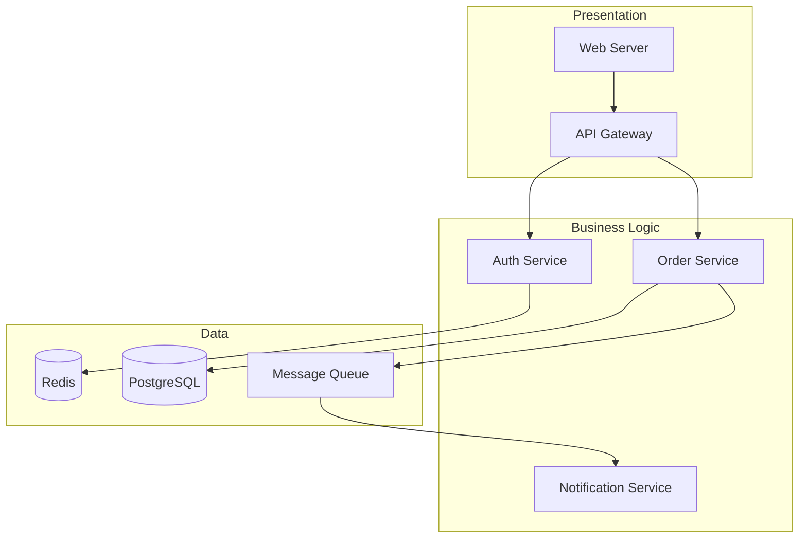
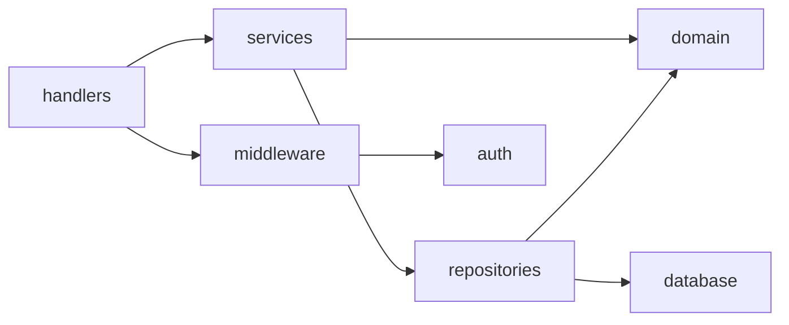
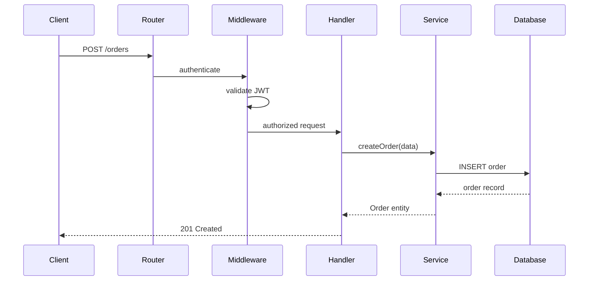

# Output Document Template

Use this template for the `docs/architecture-overview.md` working draft. Fill in each
section during Phase 1. Deep Dive sections are appended during Phase 2. The Transferable
Principles section is added during finalization.

## Template

````markdown
# Architecture Overview: {project name}

> Generated: {YYYY-MM-DD} | Language(s): {languages} | Framework(s): {frameworks}

## Project Identity

**Purpose:** {One-paragraph description of what the project does}

**Tech Stack:**
- Language(s): {e.g. TypeScript, Go}
- Framework(s): {e.g. Express, Gin}
- Build System: {e.g. npm, make}
- Key Infrastructure: {e.g. PostgreSQL, Redis, RabbitMQ}

**Repository Structure:** {monorepo / polyrepo / single-package}

{If web search was used: "Sources consulted: {list of URLs}"}

## System Architecture

**Architectural Style:** {e.g. Modular monolith with clean architecture principles}

{2-3 sentence description of the overall architectural approach}

```mermaid
(component diagram)
```

## Component Map

| Component | Responsibility | Key Files |
|-----------|---------------|-----------|
| {name} | {what it owns} | {primary files/directories} |

**Boundaries:**
- {Component A} communicates with {Component B} via {mechanism}
- {describe key boundaries and communication patterns}

## Dependency Landscape

### External

| Category | Dependencies | Purpose |
|----------|-------------|---------|
| Framework | {list} | {purpose} |
| Persistence | {list} | {purpose} |
| ... | ... | ... |

### Internal

```mermaid
(internal dependency graph)
```

## Key Flows

### Flow 1: {descriptive name}

**Trigger:** {what initiates this flow}
**Outcome:** {what it produces/achieves}

```mermaid
(sequence diagram)
```

### Flow 2: {descriptive name}

{same structure}

## Design Patterns & Choices

### Observed

- **{Pattern name}** — {where it appears, how it's used, which files}

### Inferred

- **{Choice description}** — {likely rationale, clearly labeled as inference}
  {If web-sourced: "(Source: {URL})"}

## Language-Specific Notes

{Only include this section if the codebase uses a language outside Java/C#/Python/TS/Go}

| This Codebase ({language}) | Equivalent in {familiar language} |
|---------------------------|-----------------------------------|
| {idiom/pattern} | {equivalent concept} |

## Deep Dives

{Appended during Phase 2 — each as a subsection}

## Transferable Principles

{Added during finalization}
````

## Mermaid Diagram Examples

### Component Diagram

Use `graph TD` (top-down) or `graph LR` (left-right) for component diagrams:



### Dependency Graph

Use `graph LR` for internal dependency graphs. Arrow direction means "depends on":



### Sequence Diagram

Use `sequenceDiagram` for flow tracing:



## Formatting Conventions

### Fact vs. Inference

When stating observations, use direct language:
> **Observed:** The codebase uses the Repository pattern — all database access goes
> through `*Repository` classes in `src/repositories/`.

When inferring rationale, label explicitly:
> **Inferred:** The Repository pattern likely enables swapping the database implementation
> without changing business logic, consistent with the clean architecture approach used
> throughout the project.

When using web-sourced information:
> **Inferred (source: {URL}):** According to the project wiki, the team chose event
> sourcing to satisfy audit trail requirements from the compliance team.

### Language Translation

When mapping unfamiliar language idioms, use a comparison format:
> **Rust ownership model → Java/Go equivalent:** The borrow checker enforces at compile
> time what Java developers typically handle with concurrent data structure classes
> (ConcurrentHashMap) or Go developers handle with mutexes and channels. The architectural
> impact is that Rust systems tend to use message passing between components rather than
> shared mutable state.
